<h1>Insta App</h1>

<h2>Main Activity</h2>
<h3>
The Main Activity is the launcher activity of the application. firstly checks if there is an account that is already logged in or not. if there is one it goes to Wall Activity to show the user feed. else it shows its UI components to log in or to go sign up.</h3>

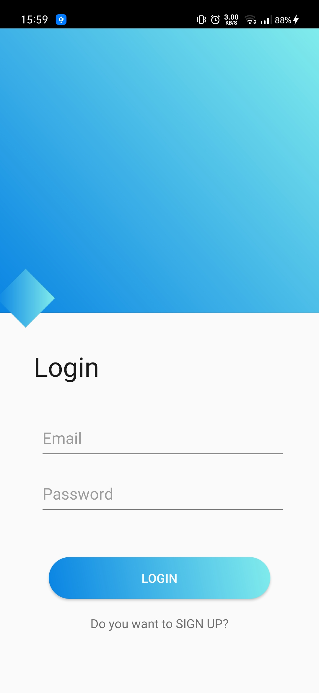
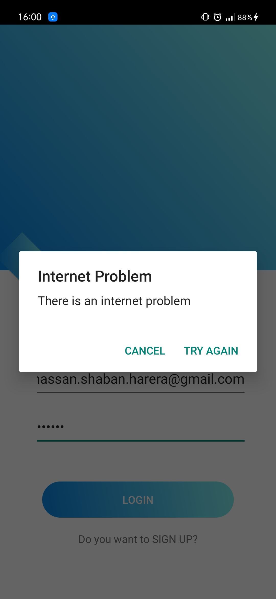
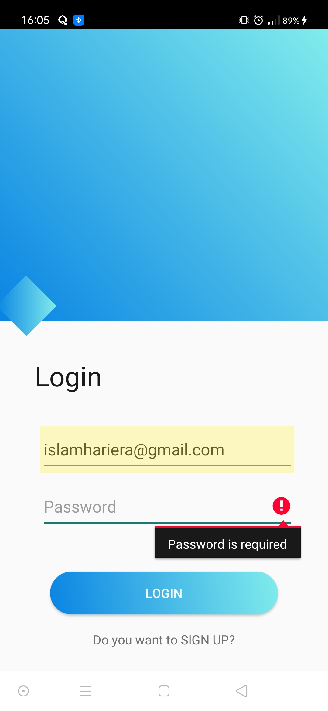

  

<h2>Register Activity</h2>
<h3>
Within Register Activity, the user can enter his name, username, password, and confirm the password. if the connection is got down there is an alert will be shown and if the username is already found in the firebase authentication there is also an alert will be shown to go login else the app will register and save the user in the firebase and login directly</h3>
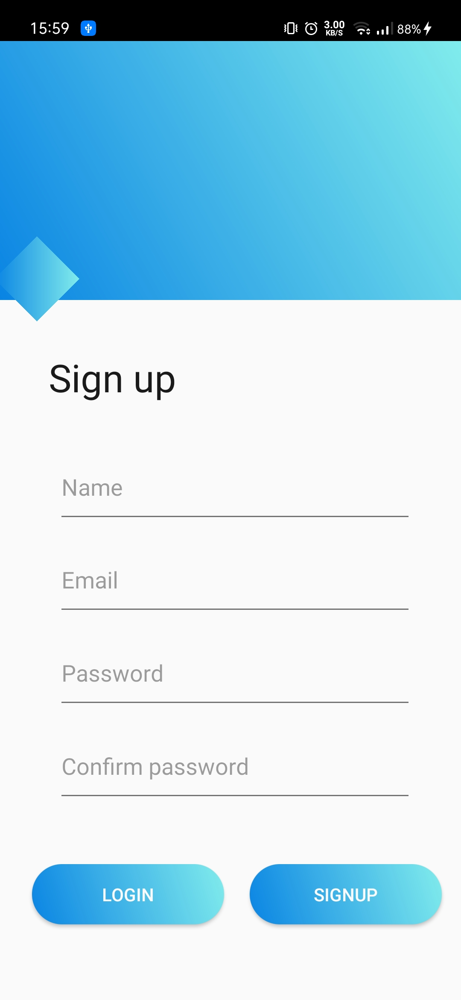
  

<h2>Wall Activity</h2>
<h3>
The Wall Activity is a basic activity that shows four tabs within Viewpager2. they are AddPost for adding new posts, Feed fragment for view his friend list posts, ViewProfile fragment that views the user posts and his info, and the Notification fragment for viewing the notifications of the use.
There is a waiting image show for 5 seconds while the app loads the required data. if the user is connected to the internet, the backend code will get the posts from his path in the firebase database and load them to the local database if he is not connected, the code will get posts from the local database which is already loaded with the posts from the firebase database
</h3>

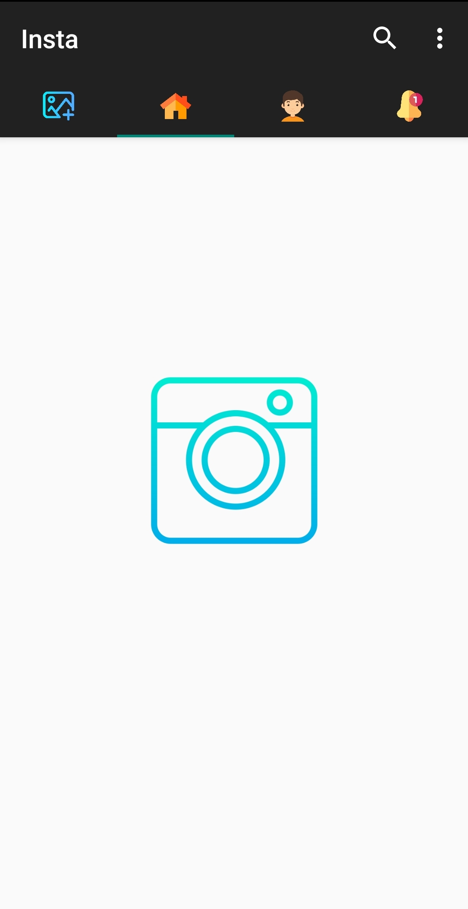
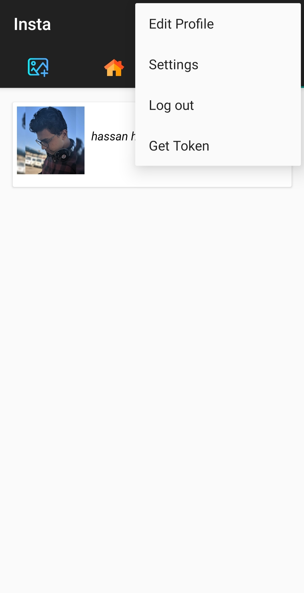

  

<h2>Feed Tab</h2>
<h3>
Within the Feed fragment, the code collects all the user friends' posts and shows them sorted from the most modern to the oldest all posts shows within a recycler view. Every post shows the post owner profile pic and the date of the post, caption, and the image.
The user can like the post and the app will notify the post owner
</h3>
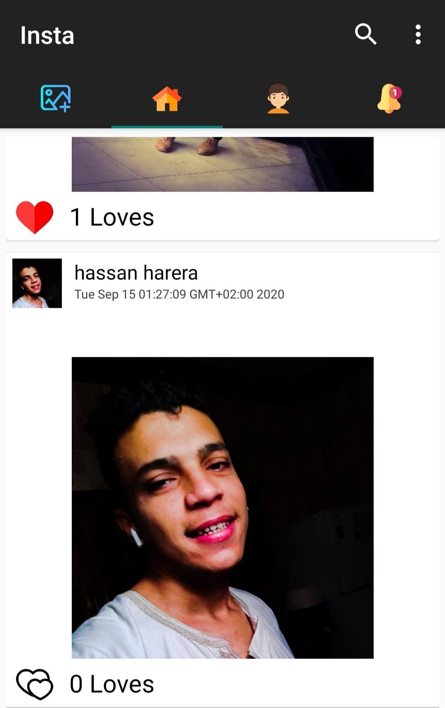
  

<h2>Profile Tab</h2>
<h3>
The Profile fragment contains the info of that user, his profile pic, name, bio, email, and all his posts and he can edit this info from the menu
</h3>

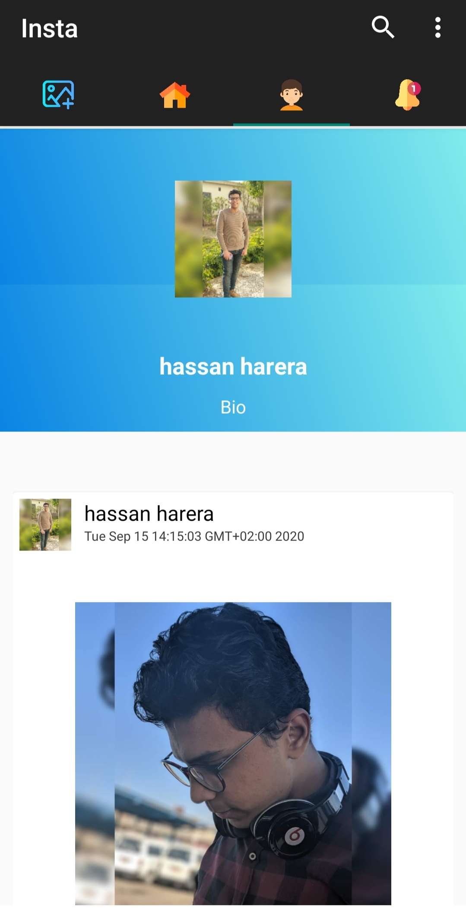
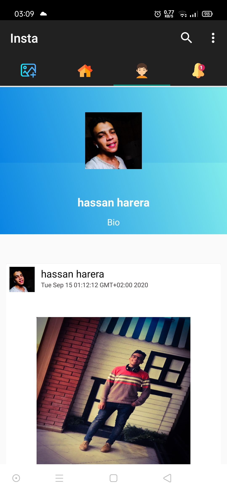
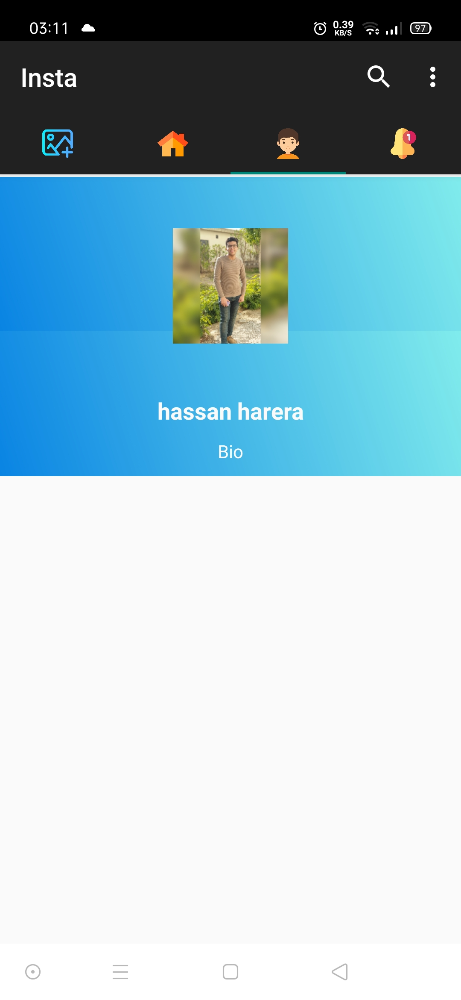

  

<h2>Notification Tab</h2>
<h3>
The Notification Tab contains all the notifications of the user. it shows the notifications within a recycler view with multiple View Holder. The data collected and is sent in a list to the Notifications adapter. the list is sorted based date. The friend request notification contains two buttons to confirm and delete. if the user confirmed the request the other user will be added to the friend list of the user and vise verse. and if clicked the request the profile of the user will be shown. Like notification, if the user clicked it will show the post with the list of the users that liked the post names.
</h3>

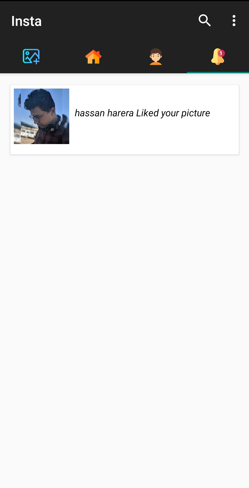
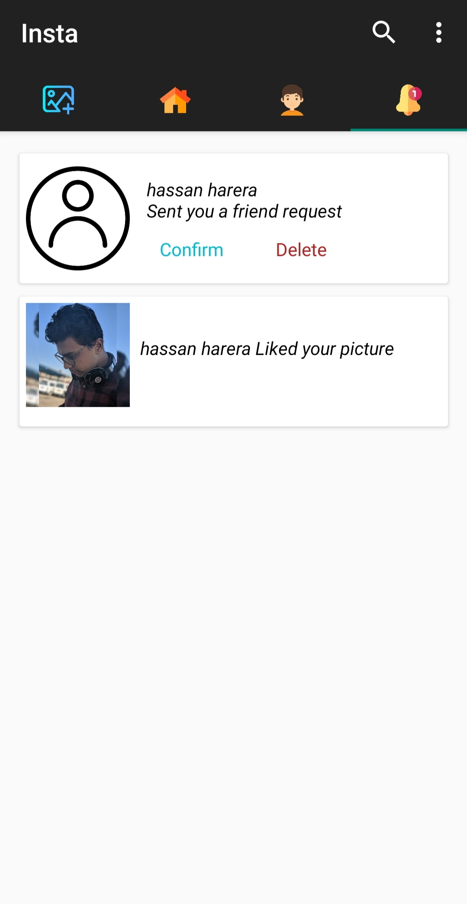
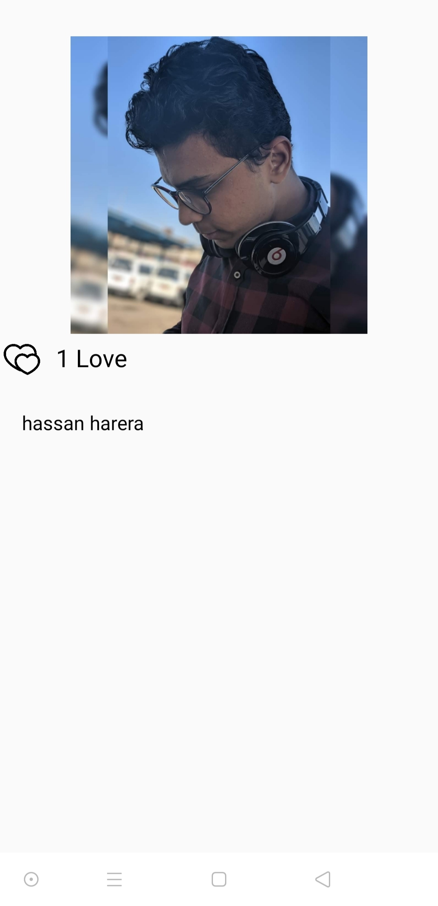

  

<h2>Add Image Tab</h2>
<h3>
it contains three main components, ImageView, an EditText for caption, and a button to add the post. when the user clicks the add button, it checks if there is an image was added or not to start adding the post.
</h3>

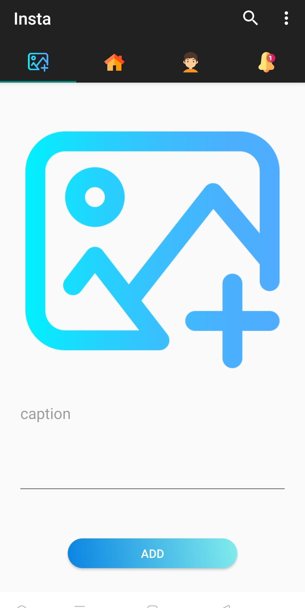
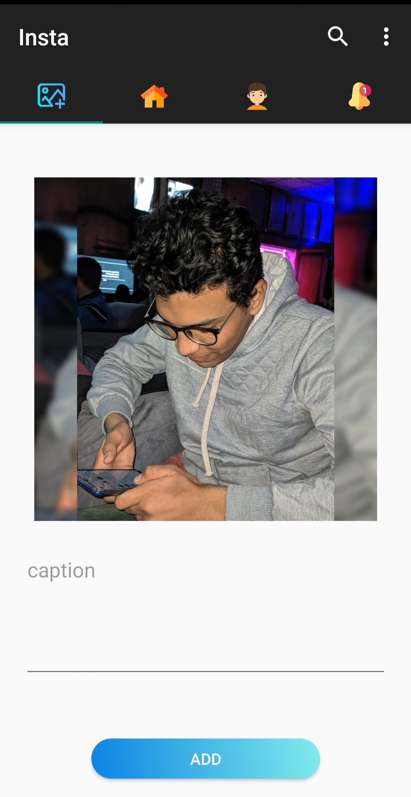

  

<h2>Edit Profile Activity</h2>
<h3>
It goes to show when the user clicked on the edit icon in the wall Activity menu. the user can change/set his profile pic, his bio, and his name.
</h3>

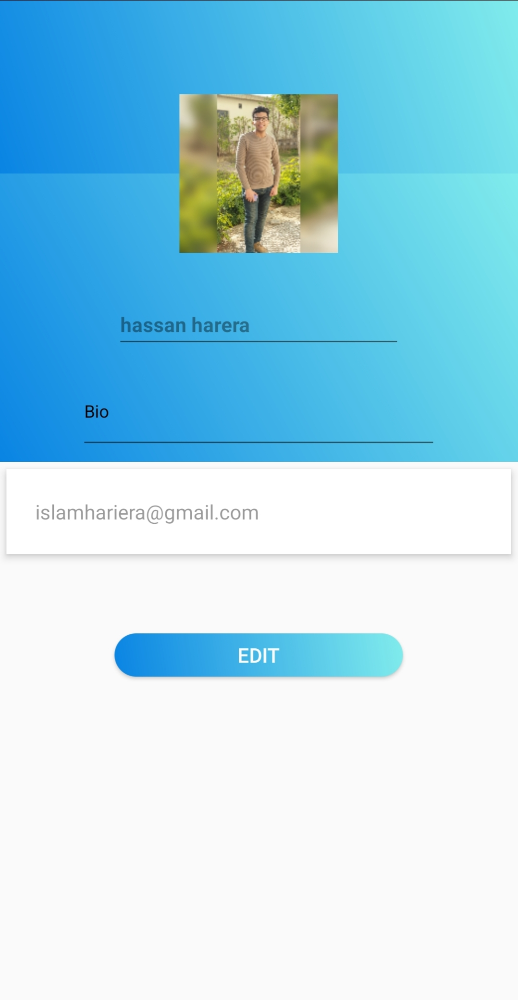

  

<h2>Visit Profile Activity</h2>
<h3>
It goes to show when the user enters a user id in the search bar in Wall Activity and this token must be correct and is already found in the database he can take it from his friend which he can copy it from the menu and this token is the UID of the user in firebase auth.  at last, shows his profile and he can see his posts and his info and he can send a friend request.
</h3>

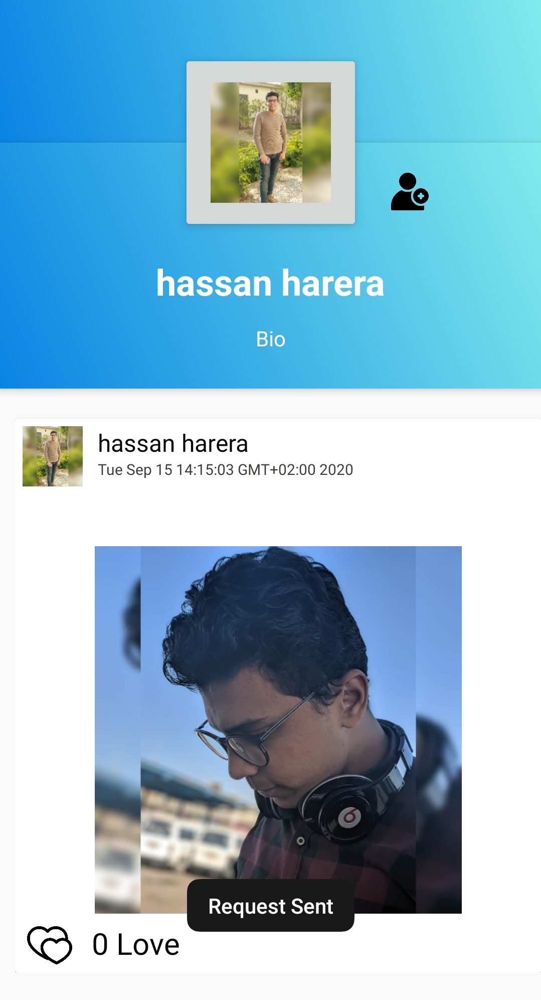
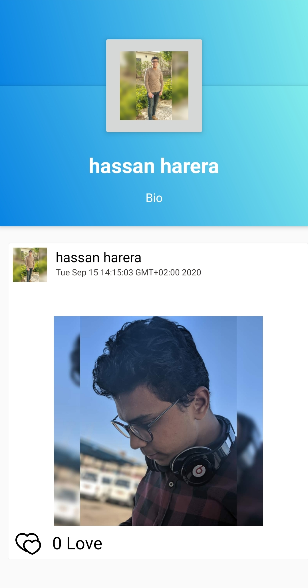
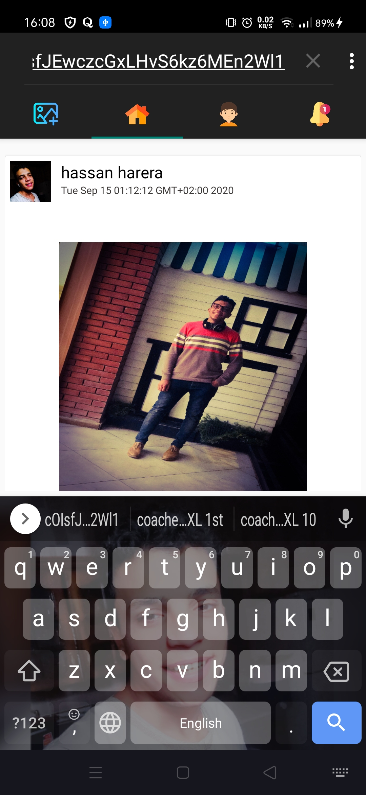

  
